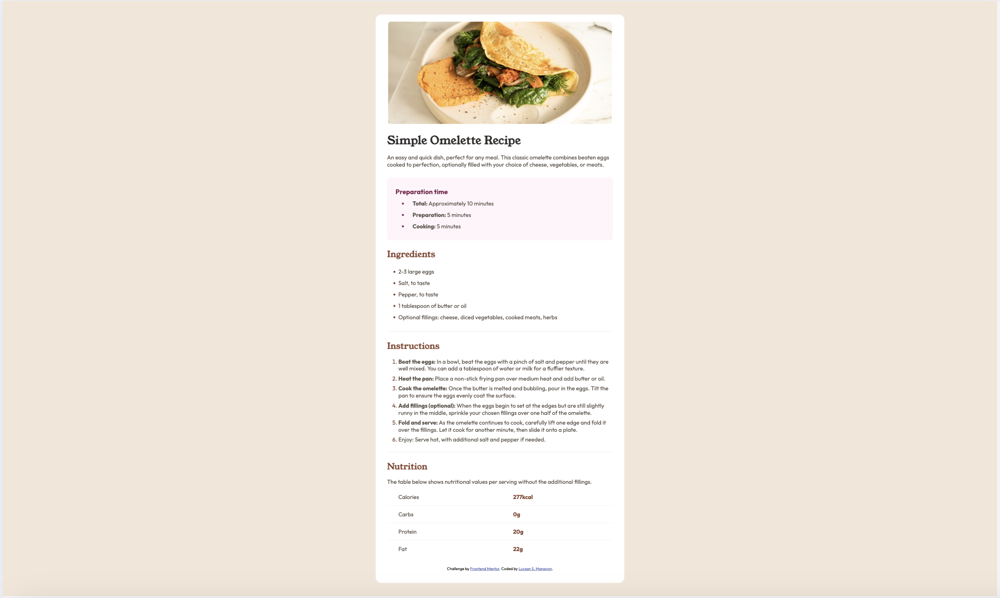

# Frontend Mentor - Recipe page solution

This is a solution to the [Recipe page challenge on Frontend Mentor](https://www.frontendmentor.io/challenges/recipe-page-KiTsR8QQKm). Frontend Mentor challenges help you improve your coding skills by building realistic projects.

## Table of contents

- [Overview](#overview)
  - [The challenge](#the-challenge)
  - [Screenshot](#screenshot)
  - [Links](#links)
  - [Built with](#built-with)
  - [What I learned](#what-i-learned)
  - [Continued development](#continued-development)
  - [Useful resources](#useful-resources)
- [Author](#author)

## Overview

A simple recipe page that is responsive.

### Screenshot




### Links

- Solution URL: []()
- Live Site URL: []()

### Built with

- Semantic HTML5 markup
- CSS custom properties
- Flexbox

### What I learned

Learned more about lists

```html
<div>
  <ul>
    <li><strong>Total:</strong> Approximately 10 minutes</li>
    <li><strong>Preparation:</strong> 5 minutes</li>
    <li><strong>Cooking:</strong> 5 minutes</li>
  </ul>
</div>
```

### Continued development

- Bootstrap
- CSS Grid
- JS

### Useful resources

- [developer.mozilla](https://developer.mozilla.org/en-US/)

## Author

- Website - [github.com/ljmanayon](https://github.com/ljmanayon)
- Frontend Mentor - [@ljmanayon](https://www.frontendmentor.io/profile/ljmanayon)
